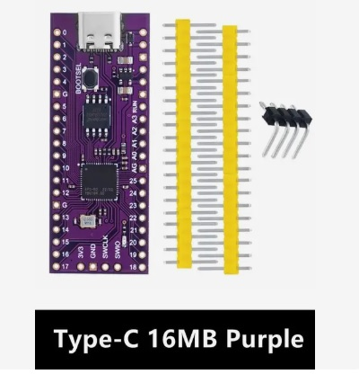
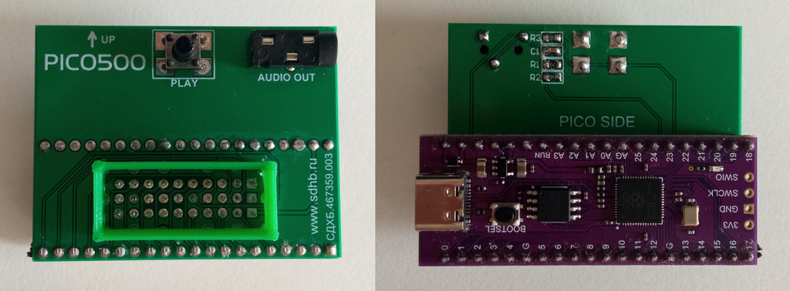

# PICO500
ROM cartridge for Vector-06C home computer

Простой ROM картридж для Вектор-06Ц на основе фиолетового китайского клона Raspberry Pi Pico.
Собирается по схеме на макетной плате за пару часов. Для программирования Pico, необходимо зажать на нём кнопку и
подключить к компьютеру шнуром Type-C. После этого в системе появится флэш накопитель "RPI-RP2". Просто перекинте на неё
прошивку pico500.hex и картриджем можно пользоваться. Принцип работы такой же как у GAME500. 
 
ВНИМАНИЕ! Схема сделана для китайского клона! 
 
<a href="https://aliexpress.ru/item/1005007614197946.html?spm=a2g2w.orderdetail.0.0.49d44aa6KEHIgo&sku_id=12000041506704923&_ga=2.98404575.1500855682.1749988093-1538674469.1689871789" border=0 target="_blank">купить на али</a>
 
В разработке печатная плата  
 

