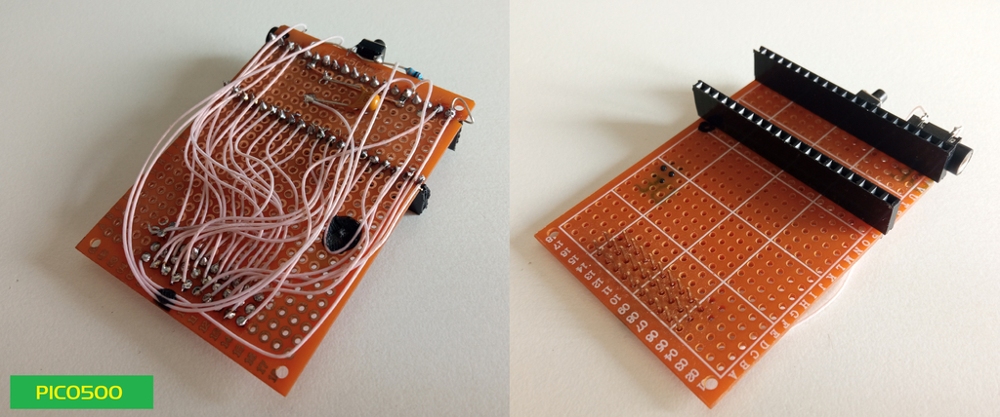

# PICO500
ROM cartridge for Vector-06C home computer

Простой ROM картридж для Вектор-06Ц на основе фиолетового китайского клона Raspberry Pi Pico.
Собирается по схеме на макетной плате за пару часов. Для программирования Pico, необходимо зажать на нём кнопку и
подключить к компьютеру шнуром Type-C. После этого на в системе появится флэш накопитель. Просто перекинте на неё
прошивку pico500.hex и картриджем можно пользоваться. Принцип работы такой же как у GAME500. 

